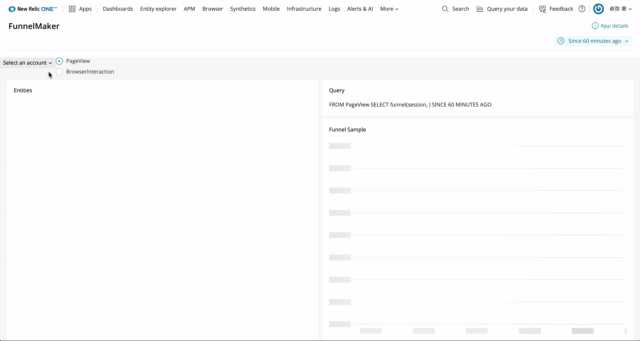

[](https://github.com/newrelic/open-source-office/blob/master/examples/categories/index.md#category-new-relic-experimental)

# Funnel Maker

## About this Nerdpack

This application show you where your user go to in your site. You can see conversion rate with funnel chart on the page.
You can copy NRQL query to make a funnel on your dashbaords.



## Open source license

This project is distributed under the [Apache 2 license](LICENSE).

## What do you need to make this work?

Required:

- [New Relic Browser agent(s) installed](https://docs.newrelic.com/docs/browser/new-relic-browser/installation/install-new-relic-browser-agent) on your web application and the related access to [New Relic One](https://newrelic.com/platform).

This nerdpack can work both of Non-SPA and SPA

## Getting started

1. Ensure that you have [Git](https://git-scm.com/book/en/v2/Getting-Started-Installing-Git) and [NPM](https://www.npmjs.com/get-npm) installed. If you're unsure whether you have one or both of them installed, run the following commands. (If you have them installed, these commands return a version number; if not, the commands aren't recognized.)
```bash
git --version
npm -v
```
2. Install the [NR1 CLI](https://one.newrelic.com/launcher/developer-center.launcher) by going to [the developer center](https://one.newrelic.com/launcher/developer-center.launcher), and following the instructions to install and set up your New Relic development environment. This should take about 5 minutes.
3. Execute the following command to clone this repository and run the code locally against your New Relic data:

```bash
nr1 nerdpack:clone -r https://github.com/Azumaxoid/nr1-funnel-maker.git
cd nr1-funnel-maker
nr1 nerdpack:serve
```

Visit [https://one.newrelic.com/?nerdpacks=local](https://one.newrelic.com/?nerdpacks=local) to launch your app locally.

## Deploying this Nerdpack

> Include the necessary steps to deploy your app. Generally, you shouldn't need to change any of these steps.

Open a command prompt in the app's directory and run the following commands.

```bash
# If you need to create a new uuid for the account to which you're deploying this app, use the following
# nr1 nerdpack:uuid -g [--profile=your_profile_name]
# to see a list of APIkeys / profiles available in your development environment, run nr1 credentials:list
nr1 nerdpack:publish [--profile=your_profile_name]
nr1 nerdpack:deploy [-c [DEV|BETA|STABLE]] [--profile=your_profile_name]
nr1 nerdpack:subscribe [-c [DEV|BETA|STABLE]] [--profile=your_profile_name]
```

Visit [https://one.newrelic.com](https://one.newrelic.com), and launch your app in New Relic.
# Contributing

> Work with the Open Source Office to update the email alias below.

Contributions are encouraged! If you submit an enhancement request, we'll invite you to contribute the change yourself. Please review our [Contributors Guide](CONTRIBUTING.md).

Keep in mind that when you submit your pull request, you'll need to sign the CLA via the click-through using CLA-Assistant. If you'd like to execute our corporate CLA, or if you have any questions, please drop us an email at opensource+{{ APP_NAME }}@newrelic.com.
